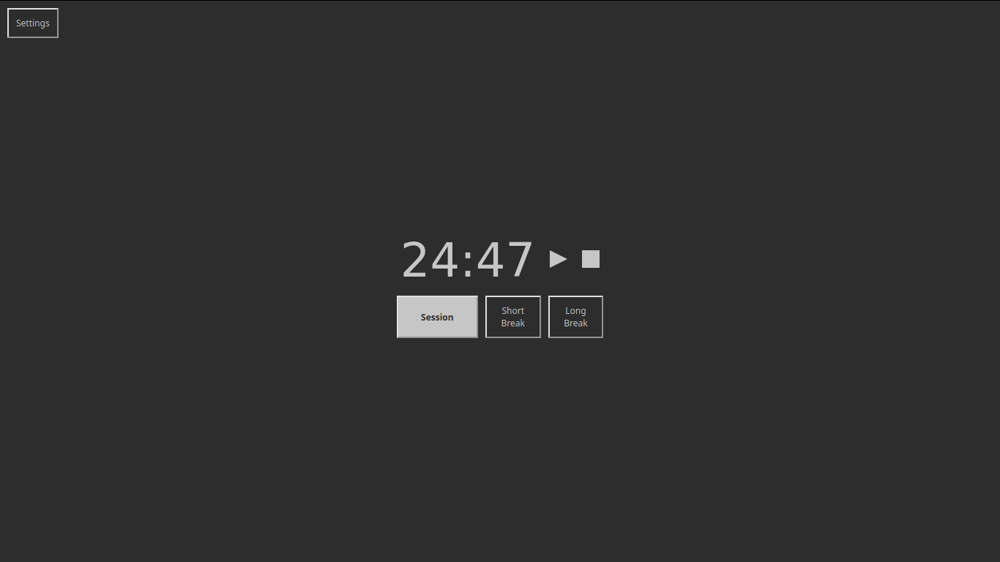

# mini tomato timer


<p align="center">Simple and minimal pomodoro timer</p>

# Features
- **Dynamic title and favicon**

  It's easy to determine how much time is left and whether timer is playing or stopped just by looking at the title and favicon.

- **Pure view**

  For those who believe that this timer is not minimal _enough_. Default keybinding is 'p' (also seen in "Settings"). When pure view is enabled, only time is shown.

# Installation
```bash
# Clone the repo and cd into it
npm install
npm run build
cd dist/ # This is the folder that contains everything the application needs
firefox index.html # Or any other browser
```

# Usage
Before using, make sure notifications are enabled. Click "Settings" button and enable it. If there is no such option, notifications are enabled. (It seems that notifications are enabled by default if using timer directly from a file, so that's why).

You are presented with "Session" (25 min), "Short Break" (5 min) and "Long Break" (10min). Click a button and the timer starts to tick. When it's done a notification is sent and alarm rings.
